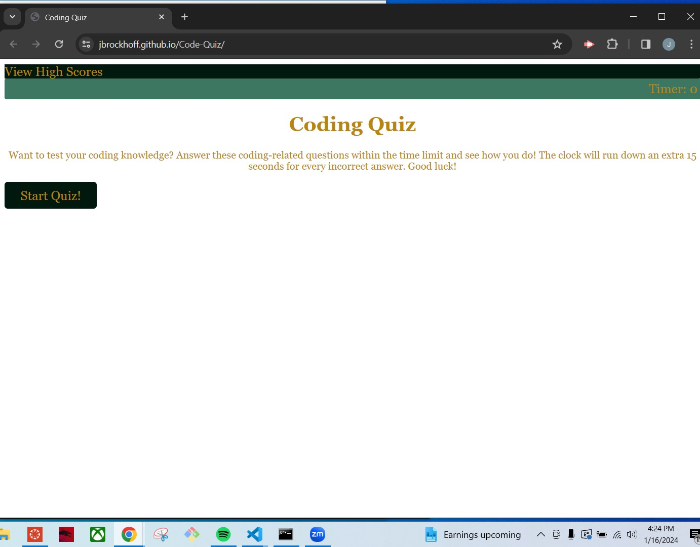

# Code-Quiz

## Description

This page is a coding quiz, created for users to test their coding knowledge in a timed game. The game provides 5 questions with 4 answers for each set of questions, and time is removed from timer if the question is answered incorrectly.

## Installation
N/A

## Usage

This is a coding quiz to test knowledge on basic coding concepts.

Here is a screenshot of the deployed application:

Here is a link to the deployed application:

https://jbrockhoff.github.io/Code-Quiz/

Here is a link to my GitHub repository for the application:

https://github.com/Jbrockhoff/Code-Quiz

## Credits

Information and tutorials obtained from the following sources:

https://www.reddit.com/r/learnprogramming/comments/14ijp4r/creating_a_quiz_in_html/

https://dev.to/sulaimonolaniran/building-a-simple-quiz-with-html-css-and-javascript-4elp

https://www.sitepoint.com/simple-javascript-quiz/

http://w3schools.com for html, CSS, and Javascript

https://www.geeksforgeeks.org/how-to-create-a-simple-javascript-quiz/

Tutoring Assitance from TA Ian Von Fange and Anastasia Warren

## License

MIT License

Copyright (c) [2024] [Jennie Brockhoff]

Permission is hereby granted, free of charge, to any person obtaining a copy
of this software and associated documentation files (the "Software"), to deal
in the Software without restriction, including without limitation the rights
to use, copy, modify, merge, publish, distribute, sublicense, and/or sell
copies of the Software, and to permit persons to whom the Software is
furnished to do so, subject to the following conditions:

The above copyright notice and this permission notice shall be included in all
copies or substantial portions of the Software.

THE SOFTWARE IS PROVIDED "AS IS", WITHOUT WARRANTY OF ANY KIND, EXPRESS OR
IMPLIED, INCLUDING BUT NOT LIMITED TO THE WARRANTIES OF MERCHANTABILITY,
FITNESS FOR A PARTICULAR PURPOSE AND NONINFRINGEMENT. IN NO EVENT SHALL THE
AUTHORS OR COPYRIGHT HOLDERS BE LIABLE FOR ANY CLAIM, DAMAGES OR OTHER
LIABILITY, WHETHER IN AN ACTION OF CONTRACT, TORT OR OTHERWISE, ARISING FROM,
OUT OF OR IN CONNECTION WITH THE SOFTWARE OR THE USE OR OTHER DEALINGS IN THE
SOFTWARE.

---
